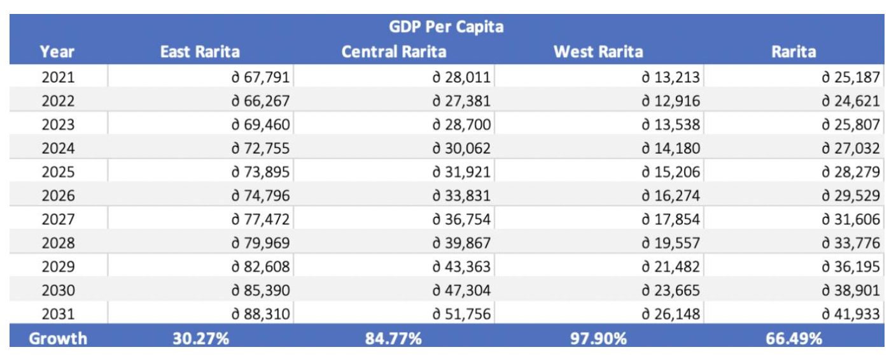

# Rarita's National Football Team Plan

_MARBS Consulting has been hired to form a competitive international football team for Rarita and to analyse the impact of
building a football “brand” on the economy. We hope to provide insight into our findings through our code, data and key figures._

---

# How did we choose our International Football Team?

## Criteria for Selection
A lasso regression model using performance features (e.g., tournament shooting, passing etc.) of each nation was used to predict their 2021 team rank. As the lasso regression model penalises non-significant features, we were able to obtain the most important variables based on their contribution to predicting 2021 tournament rank. Such variables were the following:
- Goals
- Shots from free kicks
- Percentage of passes completed 
- Percentage of passes completed within 15-30 yards
- Number of times where a pass was blocked
- Goals scored against 
- Penalty kicks missed 

---

## Probability Ranges of the "Success" being Competitive

Assuming constant and independent probabilities from year to year, they were calculated as follows:

---

## Spending on Assembling Team
Projections of salaries and expenses in [Salary_and_Expenses_Projection](Economic_Impact_and_Implementation_Plan_Analysis/'MARBS%20-%20Salary,%20revenue%20and%20expenses%20analysis%20and%20projections.xlsx') were carried out as part of introducing the national team. Other countries' growth were used as benchmarks of growth rate for Rarita. Even though growth is quite stunted in the first few years, growth is forecasted to rise significantly in the latter part of the decade, as the team expands its outreach.

The model used for salary projection is a multiple linear regression, which considers inflation, team rank and a bonus factor if the team wins the championship for that year.

---

## Direct Team Revenues
Revenue is found to follow an exponential trend, and highly correlated with social media followers and league attendance. Improving these aspects will lead to rapidly inreasing revenue in matchday and commercial areas, despite limited growth in the first few years until 2023.

To see the detailed calculations, go to [Team_Revenue_Projection](Economic_Impact_and_Implementation_Plan_Analysis/'MARBS%20-%20Salary,%20revenue%20and%20expenses%20analysis%20and%20projections.xlsx')

---

# Economic Impact

## Impact on GDP

The impact of the implementation plan on GDP was modelled through linear regression using Year, Household Savings, Revenue and Expenses as predictors. Healthcare was forecasted using an ARIMA (0,1,0) model with drift, while revenue and expenses were forecasted according to benchmark countries. The following regression model was used:

This was used to predict the GDP per capita for 2021 to 2031. Furthermore, GDP was forecasted using a time series with an ARIMA (0,1,0) model with drift to compare the difference in GDP if Rarita does not form a national team. 

The output produced is visualised in the following graph, depicting that in the long term the introduction of an International Football team will lead to an increase in GDP. 

The [code](Economic_Impact_Code.ipynb) and data used to create these insights can be accessed through these links for further understanding of the analysis conducted: [Inflation](Economic_Impact_Data/Inflation.csv)  [Household](Economic_Impact_Data/Household.csv)  [Healthcare](Economic_Impact_Data/Healthcare.csv)  [Population](Economic_Impact_Data/Population.csv)  [GDP](Economic_Impact_Data/GDP.csv)  [Rarita_train](Economic_Impact_Data/Rarita_train.csv) [Rarita_predict](Economic_Impact_Data/Rarita_predict.csv) 

#### Methodology used in code
1)  Load necessary packages
2)  Install inflation data in csv
3)  Create a time series using this data and use an ARIMA model to project this from 2021-2031
4)  Repeat steps 2 and 3 but instead using household savings data, household spending data, population data and GDP data. 
5)  Use the forecasted data for 2021-2031 for the prior variables in addition to the forecasted revenue, expenses and profit and create two excel files. The one contraining data from 2011-2020 will be the training set and the one contraining data from 2021-2031 will be the test set. 
6)  Partition the training data into a test and training set in order to test the accuracy of our model
7)  Fit a linear regression model using the selected variables (Year, Healthcare and Profit) in order to predict GDP
8)  Determine the accuracy of this model through the R squared, adjusted R squared, RMSE, MAE, p-value and accuracy of the predictions
9)  Fit the linear regression on the full training set
10)  Use this to predict the GDP for 2021-2031
11)  Graphically compare the GDP for 2021-2031, calculated using a time series, vs the GDP calculated via linear regression, which accounts for the impact of an international football team

---

## Impact on Rarita Provinces

Through analysis and manipulation in excel the respective impact of GDP on each province was determined as can be seen in the following graph and table. 

This analysis was conducted through the linked excel [document](Economic_Impact_and_Implementation_Plan_Analysis/Rarita_GDP_Economic_Impact.xlsx) while further explanation of assumptions and how this was calculated can be seen in Appendix Q of our [report](MARBS-Rarita-FSA-League-Report-2022.pdf).

---

# Implementation Plan

## Team Selection

---

## Sources of Revenue
Since only a handful of Raritan players are part of the national team, it's an opportunity to showcase other under-utilised players, assuming their guaranteed acceptance into borrowing teams. Loans can be up to 2 years per player, and the lending revenue is projected as follows:

---