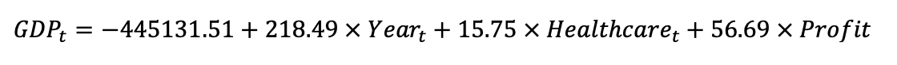
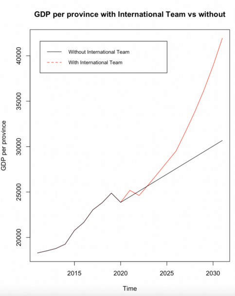
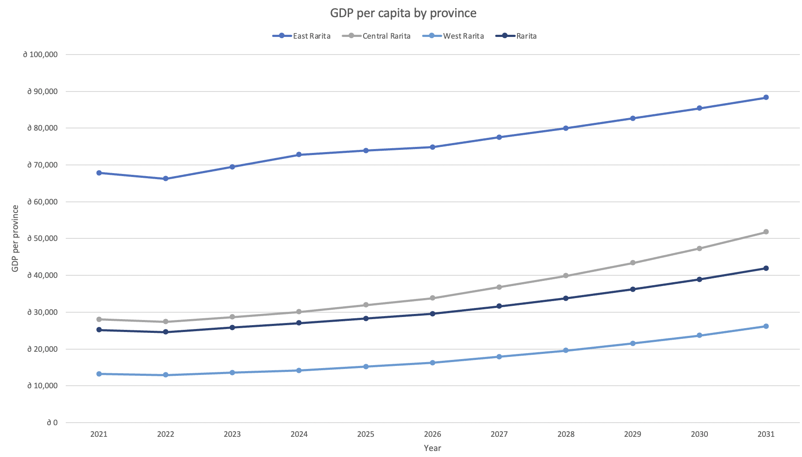
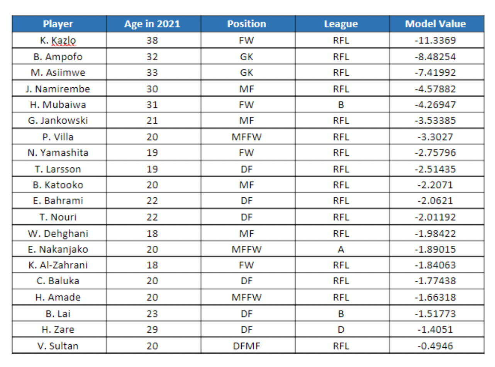

# Rarita's National Football Team Plan

_MARBS Consulting has been hired to form a competitive international football team for Rarita and to analyse the impact of
building a football “brand” on the economy. We hope to provide insight into our findings through our code, data and key figures._

---

# How did we choose our International Football Team?

## Criteria for Selection
A lasso regression model using performance features (e.g., tournament shooting, passing etc.) of each nation was used to predict their 2021 team rank. As the lasso regression model penalises non-significant features, we were able to obtain the most important variables based on their contribution to predicting 2021 tournament rank. Such variables were the following:
	Goals
	Shots from free kicks
	Percentage of passes completed 
	Percentage of passes completed within 15-30 yards
	Number of times where a pass was blocked
	Goals scored against 
	Penalty kicks missed 

## Probability Ranges of the "Success" being Competitive

Assuming constant and independent probabilities from year to year, they were calculated as follows:

## Spending on Assembling Team
Projections of salaries and expenses were carried out as part of introducing the national team. Other countries' growth were used as benchmarks of growth rate for Rarita. Even though growth is quite stunted in the first few years, growth is forecasted to rise significantly in the latter part of the decade, as the team expands its outreach.

The model used for salary projection is a multiple linear regression, which considers inflation, team rank and a bonus factor if the team wins the championship for that year.

## Direct Team Revenues
Revenue is found to follow an exponential trend, and highly correlated with social media followers and league attendance. Improving these aspects will lead to rapidly inreasing revenue in matchday and commercial areas, despite limited growth in the first few years until 2023.

# Economic Impact

## Impact on GDP

The impact of the implementation plan on GDP was modelled through linear regression using Year, Household Savings, Revenue and Expenses as predictors. Healthcare was forecasted using an ARIMA (0,1,0) model with drift, while revenue and expenses were forecasted according to benchmark countries. The following regression model was used:

This was used to predict the GDP per capita for 2021 to 2031. Furthermore, GDP was forecasted using a time series with an ARIMA (0,1,0) model with drift to compare the difference in GDP if Rarita does not form a national team. 

The output produced is visualised in the following graph, depicting that in the long term the introduction of an International Football team will lead to an increase in GDP. 

The [code](Economic_Impact_Code.ipynb) and data used to create these insights can be accessed through these links for further understanding of the analysis conducted: [Inflation](Economic_Impact_Data/Inflation.csv)  [Household](Economic_Impact_Data/Household.csv)  [Healthcare](Economic_Impact_Data/Healthcare.csv)  [Population](Economic_Impact_Data/Population.csv)  [GDP](Economic_Impact_Data/GDP.csv)  [Rarita_train](Economic_Impact_Data/Rarita_train.csv) [Rarita_predict](Economic_Impact_Data/Rarita_predict.csv) 

## Impact on Rarita Provinces

Through analysis and manipulation in excel the respective impact of GDP on each province was determined as can be seen in the following graph and table. 

This analysis was conducted through the linked excel [document](Economic_Impact_and_Implementation_Plan_Analysis/Rarita_GDP_Economic_Impact.xlsx) while further explanation of assumptions and how this was calculated can be seen in Appendix Q of our [report](MARBS-Rarita-FSA-League-Report-2022.pdf).

# Implementation Plan

## Team Selection

## Sources of Revenue
