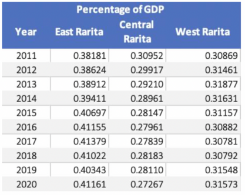
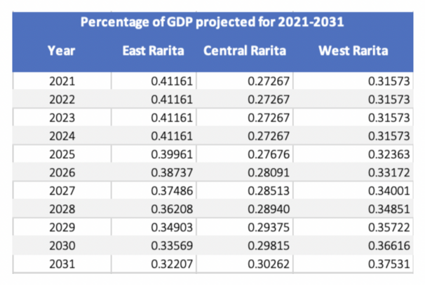

# Rarita's National Football Team Plan
## Our finalised team report can be found here: [Final Report](MARBS-Rarita-FSA-League-Report-2022.pdf)
The following sections explains our methodology of approaching the calculations for the report sections in more detail and directs our relevant working out with the sections. 

Other relevant files can be found in the folders: 
- Player analysis and selection code: [Analysis Code](Player%20Analysis%20and%20Prediction.ipynb)
- Economic analysis: [Economic Code](Economic_Impact_Code.ipynb)
- Data cleaning (Economics): [Economic Data Files](Economic_Impact_Data)
- Revenue, Expense and Projections: [Revenue and Expenses Files](Economic_Impact_and_Implementation_Plan_Analysis)
- Images and tables: [Analysis and Results Files](Images)

Thank you for reading and please enjoy. 

_MARBS Consulting has been hired to form a competitive international football team for Rarita and to analyse the impact of
building a football “brand” on the economy. The long-term objective is to add positive economic impact through such branding from competitiveness, higher tourism rates, and creating new jobs. We hope to provide insight into our findings through our code, data and key figures._

---
# Table of Contents
<!-- TABLE OF CONTENTS -->

  
Table of Contents

  <ol>
    <li>
      <a href="#how-did-we-choose-our-international-football-team?">How did we choose our International Football Team</a>
       <ol>
       <li><a href="#criteria-for-selection">Criteria for Selection</a></li>
        <li><a href="#probability-ranges-of-the-success-being-competitive">Probability Ranges of the Success being Competitive</a></li>
    </li>
    <li>
      <a href="#spending-on-assembling-team">Spending on Assembling Team</a>
    </li>
    <li>
      <a href="#direct-team-revenues">Direct Team Revenues</a>
       </ol>
    </li>
    <li>
      <a href="#economic-impact">Economic Impact</a>
      <ol>
        <li><a href="#impact-on-gdp">Impact on GDP</a></li>
        <li><a href="#impact-on-rarita-provinces">Impact on Rarita Provinces</a></li>
      </ol>
    </li>
    <li>
      <a href="#implementation-plan">Implementation Plan</a>
      <ol>
        <li><a href="#team-selection">Team Selection</a></li>
        <li><a href="#sources-of-revenue">Sources of Revenue</a></li>
      </ol>
     </li>
    <li>
      <a href="#conclusion">Conclusion</a>
    </li>
  </ol>

# How did we choose our International Football Team?

The details of our working out can be found here: [Prediction Analysis](Player%20Analysis%20and%20Prediction.ipynb) 

The below sections provide our explanation of how we proceeded to analyse the data and how the relevant code, excel spreadsheets and results should be interpreted. The appropriate files have been linked. 

## Criteria for Selection
A lasso regression model using performance features (e.g., tournament shooting, passing etc.) of each nation was used to predict their 2021 team rank. As the lasso regression model penalises non-significant features, we were able to obtain the most important variables based on their contribution to predicting 2021 tournament rank. 

The high R-squared score and cross validation score suggested that these variables were good predictors of performance. Out of all the models we created, this was the one which indicated the highest accuracy. 

We also qualitatively considered the effect of these to consider how effective they were. For example, the goals scored against (the goalkeeper) should be a strong indicator of how well a goalkeeper might perform and makes sense to be included. It should be noted that we did take into account the data limitations, where further detail is provided in that section of the report. 

All the Raritan players were processed through the model again, to select the ideal players that we would use to form our team. 

Further details can be found in the Python code above. The results can be found in our Final Report. 

---

## Probability Ranges of the Success being Competitive
Assuming constant and independent probabilities from year to year, they were calculated as follows:

A binomial probability model was assumed to determine the probability of coming first in ten years. We simplified our assumptions for this calculation because we realised that the were too many factors to assume to make an accurate prediction. For example, it is inevitable that players will be changed across all countries and teams, or that large unpredictable macro events may occur (in our current world, examples include the war in Ukraine, coronavirus pandemic etc.). 

---

## Spending on Assembling Team
Projections of salaries and expenses in [Salary_and_Expenses_Projection](Economic_Impact_and_Implementation_Plan_Analysis/MARBS%20-%20Salary,%20revenue%20and%20expense%20projections%20and%20analysis.xlsx) were carried out as part of introducing the national team. Countries that were competitively successful and exhibited the lowest GDP per capita differential with Rarita (Nganion, Galamily, Greri Landmoslands, Sobianitedrucy) were used as benchmarks for expense and revenue projections. This includes expense allocations and growth rates, and revenue streams and growth rates. Expense is forecasted to increase significantly as the team develops and revenues generated are reinvested to ensure the team's consistent improvement and performance.   
   
Salary was projected as depicted in the following formula:  
  
The key factors include inflation, winning bonus, and the increase in salary from Rarita transitioning to the national-competition level, which was only applied in the first year.   

---

## Direct Team Revenues
Revenue is found to follow an exponential trend, and highly correlated with social media followers and league attendance. Improving these aspects will lead to rapidly inreasing revenue in matchday and commercial areas, despite limited growth in the first few years until 2023.

By analysing other countries, we discovered that these factors in turn were significantly correlated with their rank in the tournament, especially if they won the tournament. We constructed a model that allocated an increase in revenue based on the probability of ranking. It also took into account inflation and external factors such as an increase in tourism or investment into the teams. 

To see the detailed calculations, go to [Team_Revenue_Projection](Economic_Impact_and_Implementation_Plan_Analysis/MARBS%20-%20Salary,%20revenue%20and%20expense%20projections%20and%20analysis.xlsx)

---

# Economic Impact

## Impact on GDP

The impact of the implementation plan on GDP was modelled through a linear regression using Year, Household Savings and Profit as predictors. Healthcare was forecasted using an ARIMA (0,1,0) model with drift, while revenue and expenses were forecasted according to benchmark countries as discussed above. Profit was then derived from revnue and expenses. The following regression model was used:

This was used to predict the GDP per capita for 2021 to 2031. Furthermore, GDP was forecasted using a time series with an ARIMA (0,1,0) model with drift in order to compare the difference in GDP if Rarita did not form a national team. 

The output produced is visualised in the following graph, depicting that in the long term the introduction of an International Football team will lead to an increase in GDP. 

The [code](Economic_Impact_Code.ipynb) and data used to create these insights can be accessed through these links for further understanding of the analysis conducted: [Inflation](Economic_Impact_Data/Inflation.csv)  [Household](Economic_Impact_Data/Household.csv)  [Healthcare](Economic_Impact_Data/Healthcare.csv)  [Population](Economic_Impact_Data/Population.csv)  [GDP](Economic_Impact_Data/GDP.csv)  [Rarita_train](Economic_Impact_Data/Rarita_train.csv) [Rarita_predict](Economic_Impact_Data/Rarita_predict.csv) 

#### Methodology used in economic impact code
1)  Load necessary packages
2)  Install inflation data csv
3)  Create a time series using this data and use an ARIMA model to project this from 2021-2031
4)  Repeat steps 2 and 3 but instead using household savings data, household spending data, population data and GDP data. 
5)  Create two excel files including forecasted data for 2021-2031 for the prior variables in addition to the forecasted revenue, expenses and profit. The file containing data from 2011-2020 will be the training set and the file containing data from 2021-2031 will be the test set. 
6)  Partition the training data into a test and training set in order to test the accuracy of our model
7)  Fit a linear regression model using the selected variables (Year, Healthcare and Profit) in order to predict GDP
8)  Determine the accuracy of this model through calculating the R squared, adjusted R squared, RMSE, MAE, p-value and accuracy of the predictions
9)  Fit the linear regression onto the full training set
10)  Use this to predict the GDP for 2021-2031
11)  Graphically compare the GDP for 2021-2031, calculated using a time series, vs the GDP calculated via linear regression, which accounts for the impact of an international football team

---

## Impact on Rarita Provinces

In order to calculate the respective impact of GDP on each province various assumptions were used, which are outlined in the following methodology. These assumptions took into account our aim of decreasing the wealth gap between the provinces. This is outlined further in our [report](MARBS-Rarita-FSA-League-Report-2022.pdf).

### Methodology used to determine the impact on Rarita Provinces
1)  The population of Rarita from 2021-2031 was projected using a [time series](Economic%20Impact%20Code.ipynb)

2)  To ascertain how the population would be distributed within Rarita’s various provinces, the percentage of population residing in each province was calculated from 2011-2021. The average population percentage from 2011-2021 was assumed to demonstrate how the population would be distributed between the provinces in 2021-2031.

3)  Using this average percentage, population per province was calculated as seen in the following table.

4)  To calculate the total GDP of Rarita from 2021-2031 the forecasted population was multiplied with the predicted GDP per capita. The next step was to determine the percentage of GDP attributable to each province from 2021-2031. The percentage of total GDP for each province was calculated for 2011-2020. It can be seen in the table below that East Rarita’s percentage of total GDP was increasing at the highest rate, followed by West Rarita, with Central Rarita’s percentage of GDP decreasing.

5)  As our implementation plan has a focus on decreasing the wealth gap between the provinces, percentage of total GDP per province for 2021-2031 was calculated in accordance. It was assumed that from 2021-2024 the percentage of GDP per province would remain that same as it did in 2020. This is because these years mark the infancy of our newly formed International Team, whilst soccer revenues remained low. However, from 2025-2031 the percentage of total GDP in Central Rarita was assumed to grow at a rate of 1.5% p.a. and the percentage of total GDP in West Rarita was assumed to grow at a rate of 2.5% p.a.

6) Using these assumptions, we were able to determine the total GDP per province from 2021-2031

7) Finally, GDP per capita was calculated as Total_GDP_t/Population_t as seen below.

This analysis was conducted in the linked [excel document](Economic_Impact_and_Implementation_Plan_Analysis/Rarita_GDP_Economic_Impact.xlsx) 

---

# Implementation Plan

## Team Selection

Twenty players have been selected from the model output, according to age, position, and league, as seen below. The first eighteen constitute the main team and substitutes, and the last two may be assigned once a player retires.

---

## Sources of Revenue
Since only a handful of Raritan players are part of the national team, it's an opportunity to showcase other under-utilised players, assuming their guaranteed acceptance into borrowing teams. Loans can be up to 2 years per player, and the lending revenue is projected as follows:

Further insight into sources of revenue calculations can be seen in the following [excel file](Economic_Impact_and_Implementation_Plan_Analysis/MARBS%20-%20Implementation%20Plan%20Sources%20of%20Revenue%2C%20Player%20Lending.xlsx)

---

# Conclusion

Furthermore, through the analysis outlined above we were able to reach our objective of building a football "brand" in Rarita. For more detailed explanation's regarding our objectives, team selection, economic impact, implementation plan, assumptions, risk and risk mitigation considerations and data and limitations please read our [report](MARBS-Rarita-FSA-League-Report-2022.pdf).
